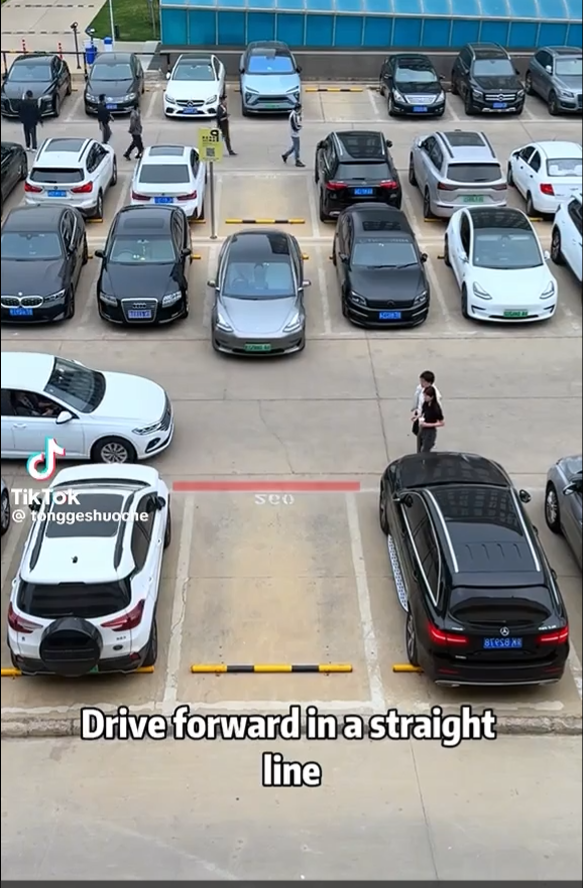
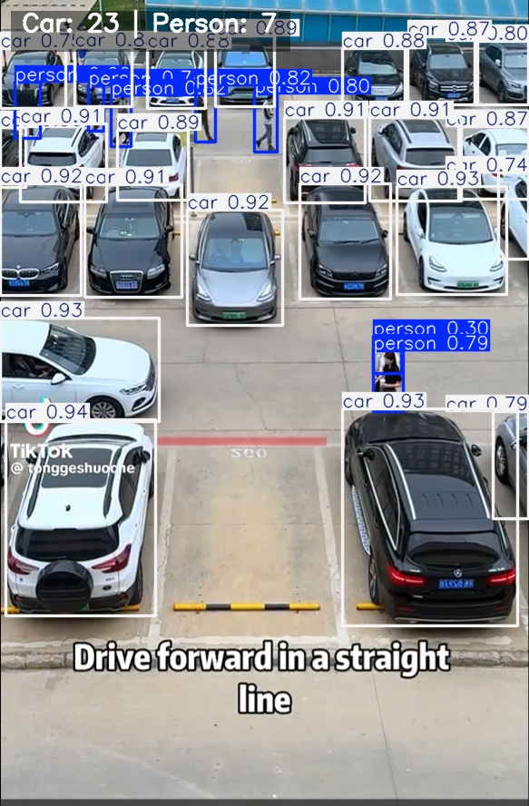
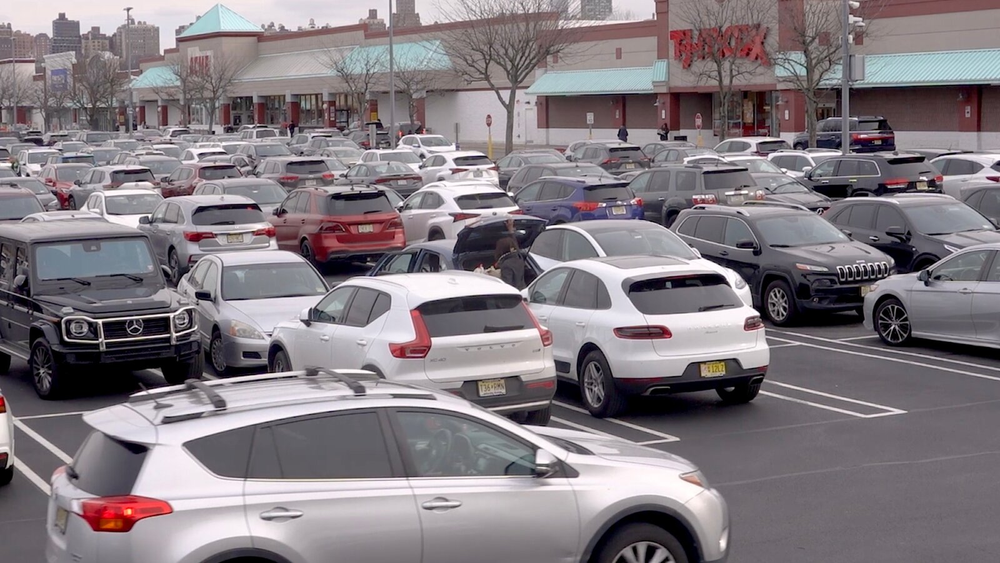
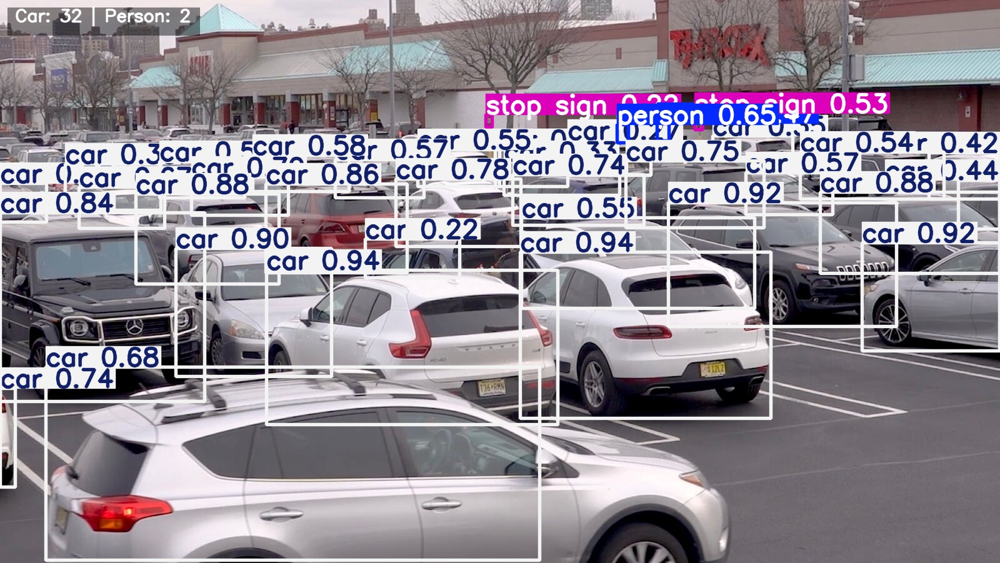
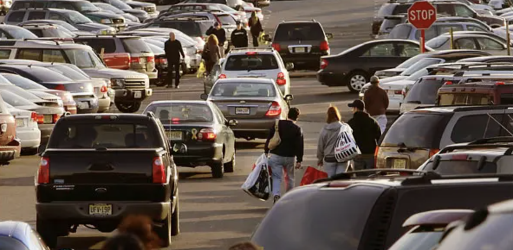
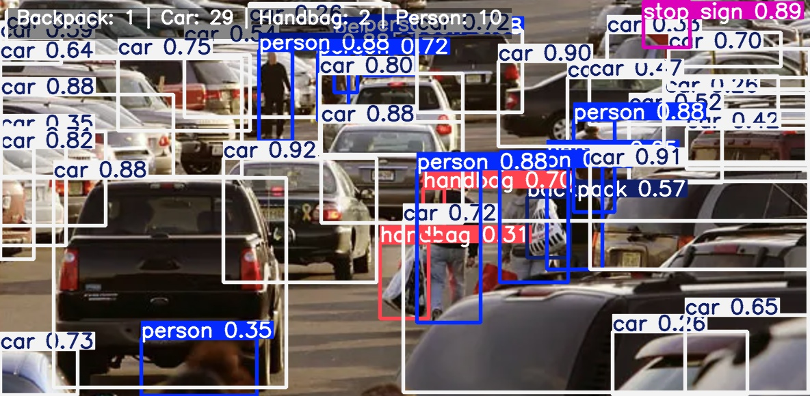

# Project Overview  
This project demonstrates **real-time object detection** using **Ultralytics YOLOv11**.  
It includes a **desktop GUI (Tkinter)**, suitable for local GPU/CPU use.  

## Key Features  
- Detects objects in **images, videos, and live camera feeds**.
 *(This report only showcases image results for clarity and simplicity.)*  
- Side-by-side **Original vs Detected** views for easy comparison.  
- Counts selected classes such as *person, car, truck, bicycle*.  

# Visual Results  

## Before and After: Image Detection  
The model identifies objects and overlays bounding boxes with class labels and confidence scores.  

### Example 1  
- **Before:** Original uploaded image.  
- **After:** Detected objects highlighted with bounding boxes.  

  
  

### Example 2  
- **Before:** Original frame from video.  
- **After:** Detected vehicles and pedestrians annotated.  

  
  
### Example 3
- **Before:** Original frame from video.  
- **After:** Detected vehicles and pedestrians annotated.  

  
  

# Quick Start (Local)  

## Tkinter Desktop App  

```bash
# 1) Create & activate a virtual environment
python -m venv .venv
# Windows
.venv\Scripts\activate
# macOS/Linux
# source .venv/bin/activate

# 2) Install requirements
pip install -r requirements.txt

# 3) Run desktop GUI
python main.py
```

# Technologies Used
- Python (app logic)
- Torch & NumPy (deep learning computations)
- Ultralytics YOLOv11 (object detection model)
- OpenCV (video/image handling)
- Pillow (image processing)
- Tkinter (desktop GUI)

# Future Improvements
- Add real-time detection dashboard in Streamlit.
- Introduce custom class training for specific use cases.
- Optimize inference speed for low-power devices.
- Add export to Excel/CSV for detection logs.
